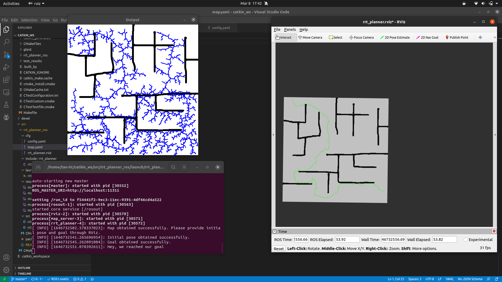
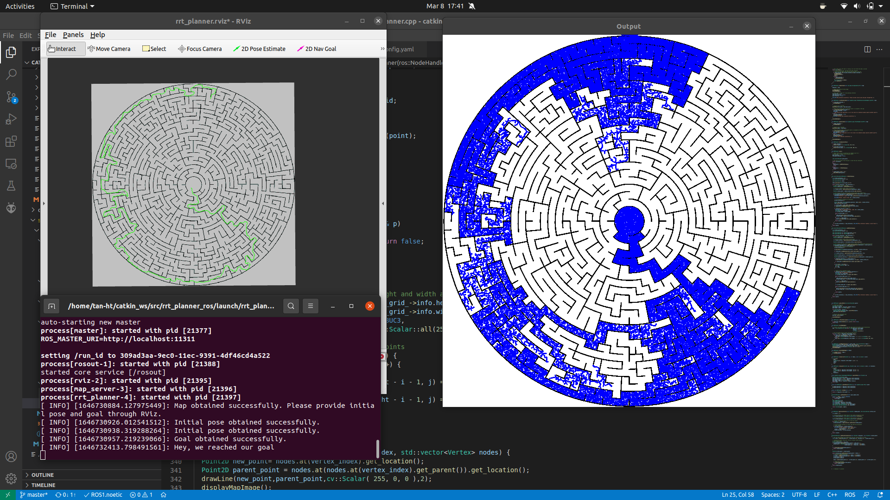

# RRT for Path Planning in ROS

## Overview

This is my implementation of the Rapidly Exploring Random Trees (RRT) algorithm to plan collision-free paths in a 2D environment with a ROS wrapper.

Based loosely on the algorithm [here](https://github.com/zhm-real/PathPlanning)

## How to run it?

Place it in your catkin workspace `src` folder and build it using:

```bash
catkin build
```

You can run the launch file given in the `launch` folder using:

```bash
roslaunch rrt_planner rrt_planner.launch
```

This launch file automatically launches three nodes:

- **RViz** For visualization
- **Map Server** to load a map from a .png file and publish it as a `nav_msgs::OccupancyGrid` on the `/map` topic
- **RRT Planner** to receive a map, initial pose, and goal pose, and calculate and publish a collision-free path as a `nav_msgs::Path` msg

### Map Server

There are 5 example map images in the [resources](resources) directory can be used to test the RRT implementation.
The map server node is responsible for loading a map file and publishing it as a `nav_msgs::OccupancyGrid` on the `/map` topic.
To select the map file that should be loaded and published, configure the parameters in [cfg/map.yaml](cfg/map.yaml) file.

### RViz

When a map has been loaded successfully it should be visible in RViz. The user can then set the initial pose and the goal pose through RViz.
Press the `2D Pose Estimate` button in RViz to set the initial pose. Press the `2D Nav Goal` button in RViz to set the goal pose.
Or you can provide the same through the topics `/initialpose` and `/move_base_simple/goal` respectively.

## Modification

Change the parameters in the [cfg/config.yaml](cfg/config.yaml) file to configure the algorithm:

- Variation: the variantion of RRT we use for path finding
  - 1: Bi Directional RRT algorithm
  - Other numbers : Vanilla RRT algorithm
- Step_size: the max Euclidean distance for a new connection
- Delta: the interval distance to check for collision between 2 points of the connections
- Max_iteration: the max number of sample to do before concluding that no path can be found

## Example Runs

### Bi-directional for map 1



### Bi-directional for map 5


